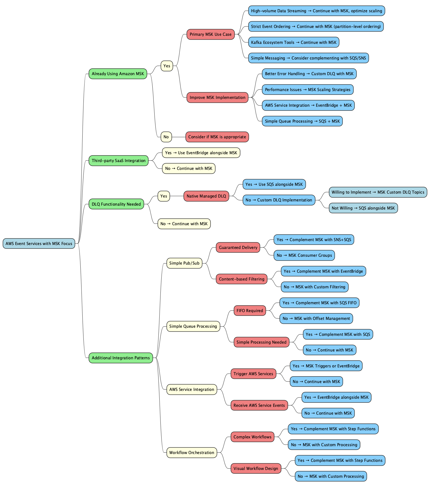

# AWS Event Services Decision Graph with MSK Focus

This document provides a decision graph to help select the appropriate AWS event service based on integration patterns and requirements, with a primary focus on Amazon MSK for customers who already have MSK deployed.



## AWS Event Services Overview

AWS offers several event-driven services that can be used for different integration patterns, with Amazon MSK serving as a central event backbone:

1. **Amazon MSK (Managed Streaming for Apache Kafka)** - Fully managed Apache Kafka service for high-throughput event streaming
2. **Amazon EventBridge** - Serverless event bus service for AWS service integration
3. **Amazon SNS** - Pub/sub messaging service for simple fan-out patterns
4. **Amazon SQS** - Fully managed message queuing service for decoupled processing
5. **Amazon Kinesis** - Real-time data streaming service for AWS-native streaming
6. **AWS Step Functions** - Serverless workflow orchestration service
7. **Amazon MQ** - Managed message broker service for ActiveMQ and RabbitMQ

## MSK-Focused Decision Graph

```
Start
│
├─ Are you already using Amazon MSK?
│  │
│  ├─ What's your primary use case with MSK?
│  │  │
│  │  ├─ High-volume data streaming → Continue with MSK, consider scaling strategies
│  │  │
│  │  ├─ Need to process events in strict order → Continue with MSK (partition-level ordering)
│  │  │
│  │  ├─ Need Kafka-compatible ecosystem tools → Continue with MSK
│  │  │
│  │  └─ Simple messaging without Kafka-specific features → Consider complementing with SQS/SNS for simpler workloads
│  │
│  └─ Do you need to improve your current MSK implementation?
│     │
│     ├─ Need better error handling → Implement custom DLQ with MSK
│     │
│     ├─ Experiencing performance issues → Consider MSK scaling strategies
│     │
│     ├─ Need to integrate with AWS services → Consider EventBridge for AWS service integration while keeping MSK
│     │
│     └─ Need simpler queue-based processing for some workloads → Add SQS for those specific workloads
│
├─ Do you need to integrate with third-party SaaS applications?
│  ├─ Yes → Use EventBridge alongside MSK
│  └─ No ↓
│
├─ Do you need Dead Letter Queue (DLQ) functionality?
│  │
│  ├─ Yes ↓
│  │  │
│  │  ├─ Do you need native, managed DLQ support?
│  │  │  ├─ Yes → Use Amazon SQS alongside MSK for DLQ functionality
│  │  │  └─ No ↓
│  │  │
│  │  └─ Are you willing to implement custom DLQ logic?
│  │     ├─ Yes → Implement custom DLQ with MSK (dedicated error topics)
│  │     └─ No → Use Amazon SQS for DLQ functionality alongside MSK
│  │
│  └─ No ↓
│
├─ What additional integration patterns do you need beyond MSK?
│  │
│  ├─ Simple Pub/Sub (Fan-out) ↓
│  │  │
│  │  ├─ Do you need guaranteed delivery to all subscribers?
│  │  │  ├─ Yes → Complement MSK with SNS+SQS for specific fan-out patterns
│  │  │  └─ No → Use MSK consumer groups or complement with SNS for simple cases
│  │  │
│  │  └─ Do you need content-based filtering?
│  │     ├─ Yes → Complement MSK with EventBridge for filtered routing
│  │     └─ No → Use MSK consumer groups with filtering logic
│  │
│  ├─ Simple Queue-based messaging ↓
│  │  │
│  │  ├─ Do you need FIFO (exactly-once processing)?
│  │  │  ├─ Yes → Complement MSK with SQS FIFO queues for specific workloads
│  │  │  └─ No → Use MSK with consumer offset management
│  │  │
│  │  └─ Do you need very simple queue processing without Kafka complexity?
│  │     ├─ Yes → Complement MSK with SQS for simpler workloads
│  │     └─ No → Continue using MSK
│  │
│  ├─ AWS Service Integration ↓
│  │  │
│  │  ├─ Do you need to trigger AWS services based on events?
│  │  │  ├─ Yes → Use MSK triggers for Lambda or complement with EventBridge
│  │  │  └─ No → Continue using MSK
│  │  │
│  │  └─ Do you need to receive events from AWS services?
│  │     ├─ Yes → Use EventBridge alongside MSK
│  │     └─ No → Continue using MSK
│  │
│  └─ Workflow orchestration ↓
│     │
│     ├─ Do you need to coordinate complex workflows?
│     │  ├─ Yes → Complement MSK with Step Functions
│     │  └─ No → Use MSK with custom processing logic
│     │
│     └─ Do you need visual workflow design?
│        ├─ Yes → Complement MSK with Step Functions
│        └─ No → Use MSK with custom processing logic
```

## MSK Integration Patterns

For customers already using Amazon MSK, here are recommended integration patterns:

### 1. MSK as Central Event Backbone

```
[Data Sources] → [MSK] → [Primary Event Processing]
                   ↓
     ┌────────────┴───────────────┐
     ↓                            ↓
[EventBridge]                    [SQS]
(AWS Service Integration)        (Simple Queue Processing)
     ↓                            ↓
[Lambda/Step Functions]         [EC2/ECS Consumers]
```

**When to use this pattern:**
- When MSK is your primary event backbone
- When you need to integrate with AWS services (use EventBridge)
- When you need simple queue processing for specific workloads (use SQS)

### 2. MSK with Custom DLQ Implementation

```
[Producers] → [MSK Main Topics] → [Consumers]
                    ↓
              [MSK DLQ Topics] → [DLQ Processors]
                                      ↓
                               [Monitoring/Alerting]
```

**When to use this pattern:**
- When you need error handling in your Kafka workloads
- When you want to maintain Kafka compatibility throughout your pipeline
- When you need custom error handling logic

### 3. Hybrid MSK and SQS Architecture

```
[High-Volume/Ordered Events] → [MSK] → [Stream Processors]
                                          ↓
[Simple Messaging Workloads] → [SQS] → [Queue Processors]
```

**When to use this pattern:**
- When you have different types of workloads with different requirements
- When some workloads benefit from Kafka features while others are simpler
- When you want to optimize cost by using the right service for each workload

## MSK Optimization Recommendations

For customers already using Amazon MSK, consider these optimization strategies:

### 1. Scaling Strategies
- Increase partition count to match expected throughput and consumer parallelism
- Scale horizontally by adding more brokers
- Scale vertically by using larger instance types
- Consider MSK Provisioned Throughput for predictable performance
- Monitor partition distribution with CloudWatch metrics
- Implement partition reassignment for balance when adding brokers

### 2. Error Handling
- Implement custom DLQ topics within MSK
- Add error metadata to DLQ messages
- Create monitoring for DLQ topics
- Implement retry mechanisms before sending to DLQ
- Consider implementing a secondary DLQ for critical systems

### 3. Performance Optimization
- Configure optimal producer batching (batch size, linger time)
- Use compression for large messages (snappy is a good balance)
- Optimize consumer fetch size and processing
- Implement parallel processing within consumers
- Consider message key distribution for even partition load
- Implement consumer backpressure mechanisms

### 4. Integration with AWS Services
- Use MSK Connect for managed Kafka Connect deployments
- Implement Lambda consumers for serverless processing
- Consider EventBridge for routing events to other AWS services
- Use SQS for simpler workloads that don't require Kafka features
- Use Kinesis Data Firehose for data delivery to S3, Redshift, etc.

## AWS Messaging Services Comparison with MSK Focus

| Feature | Amazon MSK | Amazon SQS | Amazon SNS | EventBridge | Kinesis |
|---------|------------|------------|------------|-------------|---------|
| **Primary Use Case** | Stream processing, event sourcing | Queue-based workload decoupling | Pub/sub notifications | Event routing and filtering | Real-time data streaming |
| **Throughput** | Very High (MB/s to GB/s) | High | High | Medium | High |
| **Latency** | Low (sub-second) | Variable (ms to seconds) | Low (ms) | Low (ms) | Low (sub-second) |
| **Ordering** | Guaranteed within partition | FIFO queues only | Not guaranteed | Not guaranteed | Guaranteed within shard |
| **Retention** | Configurable (hours to years) | 14 days max | No retention | 24 hours | 24 hours to 365 days |
| **Native DLQ** | No (requires custom implementation) | Yes | No | No | No |
| **Scaling** | Manual scaling (broker count/size) | Automatic | Automatic | Automatic | Manual (shard count) |
| **Ecosystem** | Rich Kafka ecosystem | AWS-specific | AWS-specific | AWS-specific | AWS-specific |
| **Best For** | High-volume streaming, event sourcing, when Kafka compatibility is required | Simple queue processing, when native DLQ is needed | Simple pub/sub messaging | AWS service integration, event filtering | Real-time analytics when Kafka not required |
## When to Complement MSK with Other AWS Services

While maintaining MSK as your primary event backbone, consider these complementary services for specific use cases:

### 1. Use SQS alongside MSK when:
- You need simple queue processing without Kafka-specific features
- You need native, managed DLQ functionality
- You want automatic scaling without managing partitions
- You have workloads with variable or unpredictable throughput

### 2. Use SNS alongside MSK when:
- You need simple pub/sub messaging without complex routing
- You need to fan out messages to multiple subscribers
- You don't need message persistence beyond delivery

### 3. Use EventBridge alongside MSK when:
- You need to integrate with AWS services or third-party SaaS applications
- You need content-based filtering and routing
- You need schema validation for events

### 4. Use Step Functions alongside MSK when:
- You need to orchestrate complex workflows across multiple services
- You need visual workflow design and monitoring
- You need built-in error handling and retry logic

## Real-World MSK Architecture Examples

### High-Throughput Event Processing Architecture

```
[Producers] → [MSK (r5.4xlarge, 9 brokers)] → [Primary Consumers (ECS Fargate)] → [Processing Service] → [DynamoDB]
                      ↓
            [Secondary Consumers] → [S3 Data Lake] → [Athena/EMR for Analytics]
```

**Implementation details:**
- 9-broker MSK cluster with r5.4xlarge instances
- Topics with 27+ partitions (3× broker count)
- Consumer groups with auto-scaling based on lag metrics
- Message batching with optimized serialization (Avro/Protobuf)
- Separate consumer groups for different processing priorities

### Near Real-Time Analytics Architecture

```
[Data Sources] → [MSK] → [Lambda Consumers] → [ElastiCache] → [API Gateway] → [Real-time Dashboards]
                   ↓
           [Kinesis Firehose] → [S3] → [Athena/Redshift] → [Analytics Dashboards]
```

**Implementation details:**
- MSK Connect with custom SMT (Single Message Transforms)
- Lambda consumers with optimized batch size and concurrency
- Kinesis Firehose for S3 delivery with optimized buffer settings
- CloudWatch metrics for consumer lag monitoring

## Conclusion

For customers already invested in Kafka/MSK, the best approach is typically to maintain MSK as the central event backbone while strategically integrating with other AWS messaging services for specific use cases. This hybrid approach leverages the strengths of MSK for high-throughput, ordered event processing while taking advantage of the simplicity and managed features of services like SQS, SNS, and EventBridge where appropriate.

By following the decision graph and recommendations in this document, you can optimize your MSK implementation while making informed decisions about when to incorporate other AWS messaging services into your architecture.
